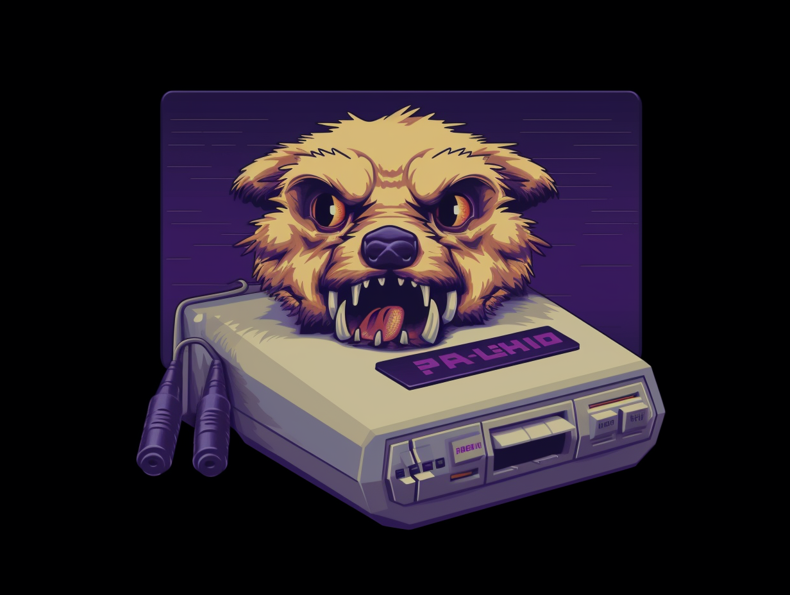

# DOG ETH BTC

## The Game

This game was created in a unique collaboration between Kristofer The Promptgiver and The Machine (OpenAI). This README serves as an overview of the project and a tutorial for newbie coders looking to learn how to create games using OpenAI.

## Table of Contents

- [Introduction](#introduction)
- [Creating the Game](#creating-the-game)
  - [Initial Setup](#initial-setup)
  - [Adding Graphics and Assets](#adding-graphics-and-assets)
  - [Adding Gameplay Elements](#adding-gameplay-elements)
  - [Collaboration and Prompting](#collaboration-and-prompting)
- [Credits](#credits)

## Introduction

This side-scrolling game features a dog eating Bitcoin (BTC) coins. When all the coins are eaten, the level is complete. The project combines OpenAI-generated code with visual assets created by Midjourney to form a complete and engaging game experience.

## Creating the Game

### Initial Setup

Kristofer The Promptgiver provided instructions and prompts to The Machine (OpenAI), which generated code snippets in response. The game is built using JavaScript and the HTML5 Canvas API.

The initial setup involved creating an HTML file with a canvas element and a linked JavaScript file:

```html
<!DOCTYPE html>
<html lang="en">
  <head>
    <meta charset="UTF-8" />
    <meta name="viewport" content="width=device-width, initial-scale=1.0" />
    <title>Side-scrolling Platform Game</title>
  </head>
  <body>
    <canvas id="gameCanvas" width="800" height="600"></canvas>
    <script src="game.js"></script>
  </body>
</html>
```

### Adding Graphics and Assets

Midjourney provided graphical assets for the game, including the dog character, coins, and background images. The Machine generated code to load and display these images using the Canvas API.

For example, to load and display the dog character:

```
let dogImage = new Image();
dogImage.src = 'path/to/dog-image.png';

ctx.drawImage(dogImage, dog.x, dog.y);
```

### Adding Gameplay Elements

The Machine generated code for various gameplay elements, such as character movement, collision detection, and parallax scrolling backgrounds.

For example, to move the character based on keyboard input:

```javascript
document.addEventListener("keydown", (e) => {
  if (e.key === "ArrowLeft") {
    dog.vx = -5;
  } else if (e.key === "ArrowRight") {
    dog.vx = 5;
  }
});
```

```javascript
document.addEventListener("keyup", (e) => {
  if (e.key === "ArrowLeft" || e.key === "ArrowRight") {
    dog.vx = 0;
  }
});
```

### Collaboration and Prompting

Throughout the project, Kristofer The Promptgiver provided specific instructions and prompts to The Machine, which generated code snippets in response. This unique collaboration allowed the creation of a complete and engaging game experience.

For example, Kristofer prompted for parallax scrolling and moving coins:

> "Can you help me make a parallax scrolling background for my game? I want it to move slower than the foreground and have multiple layers."

In response, The Machine provided code for parallax scrolling, which was then incorporated into the game.

## Credits

- All code generated by OpenAI
- All images generated by Midjourney
- This README written by OpenAI
- Game created through collaboration between Kristofer The Promptgiver and The Machine (OpenAI)
